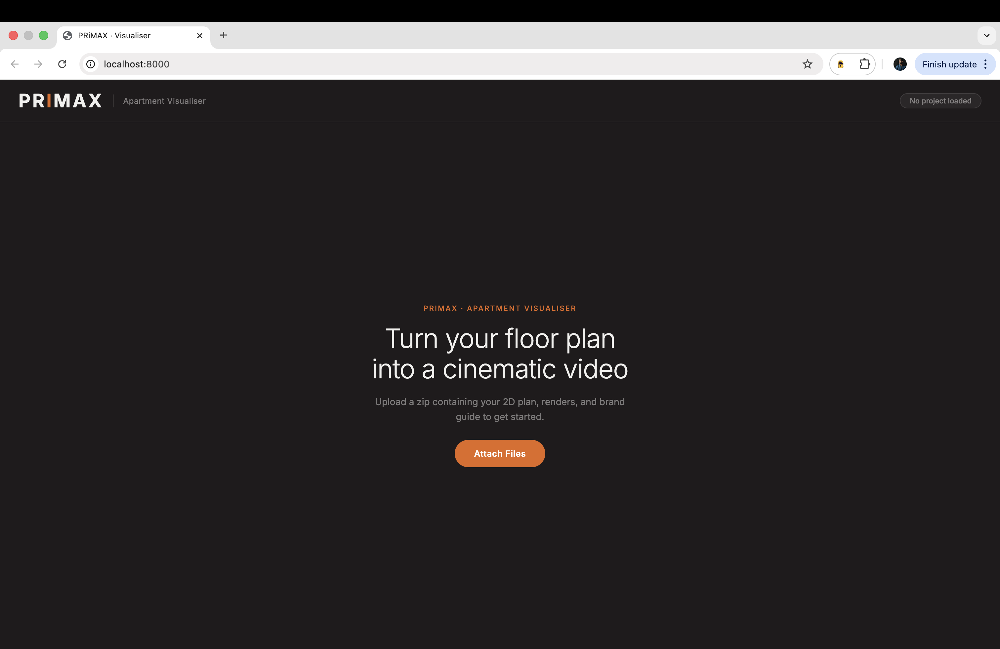
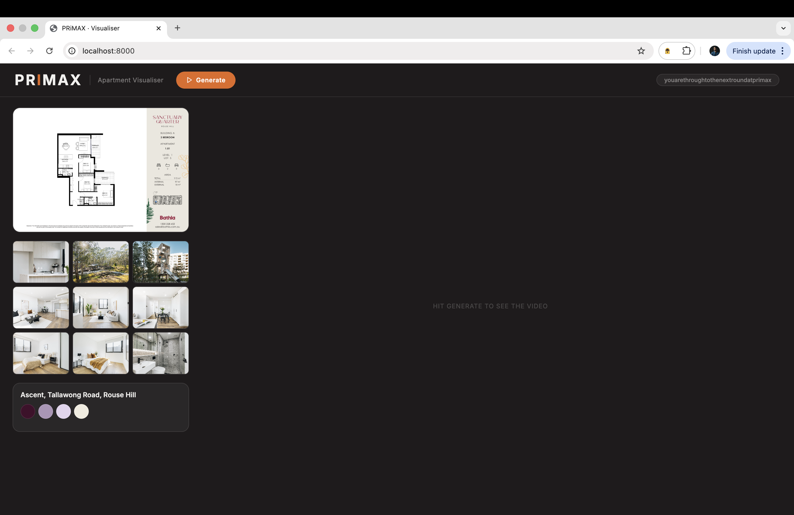
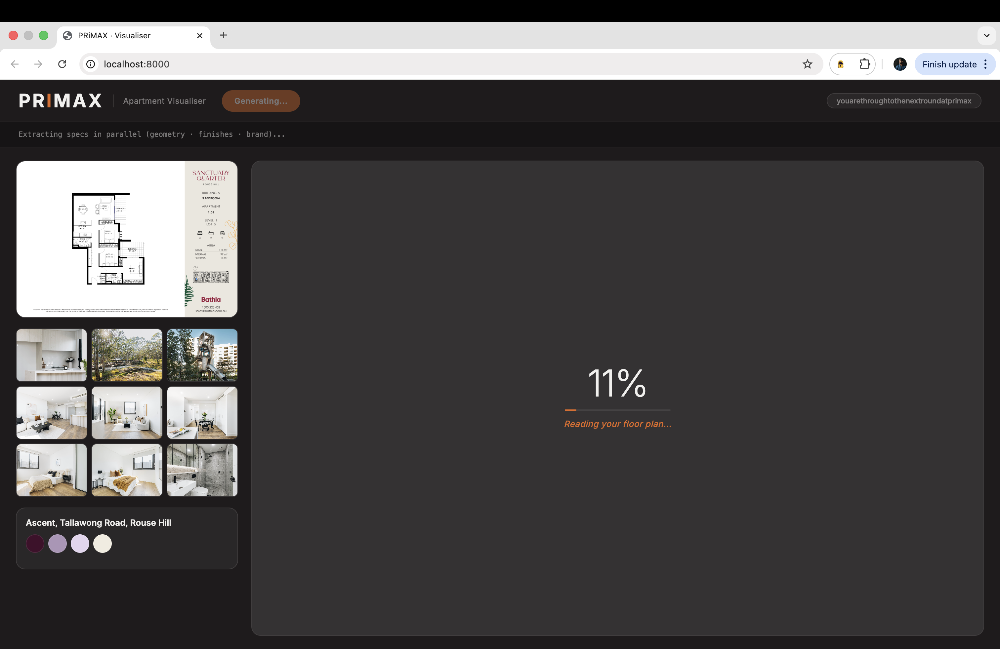
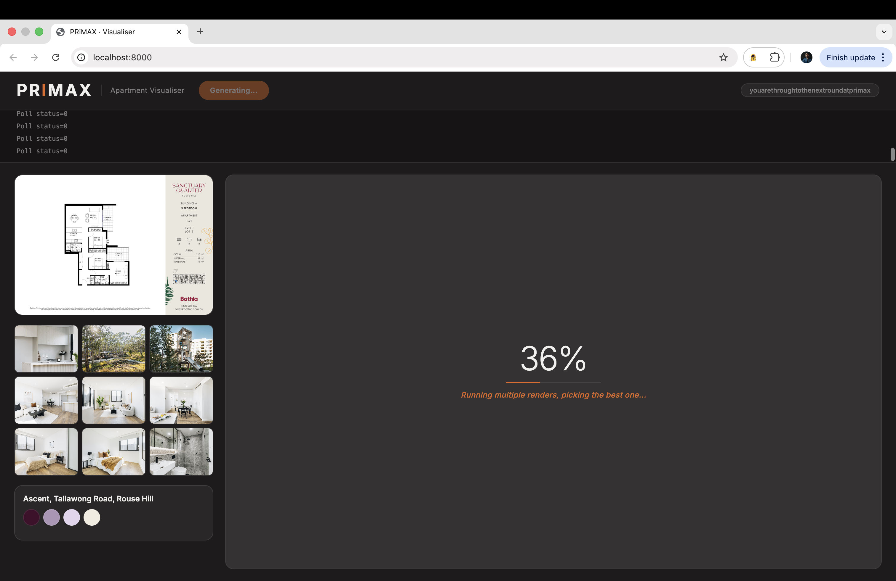
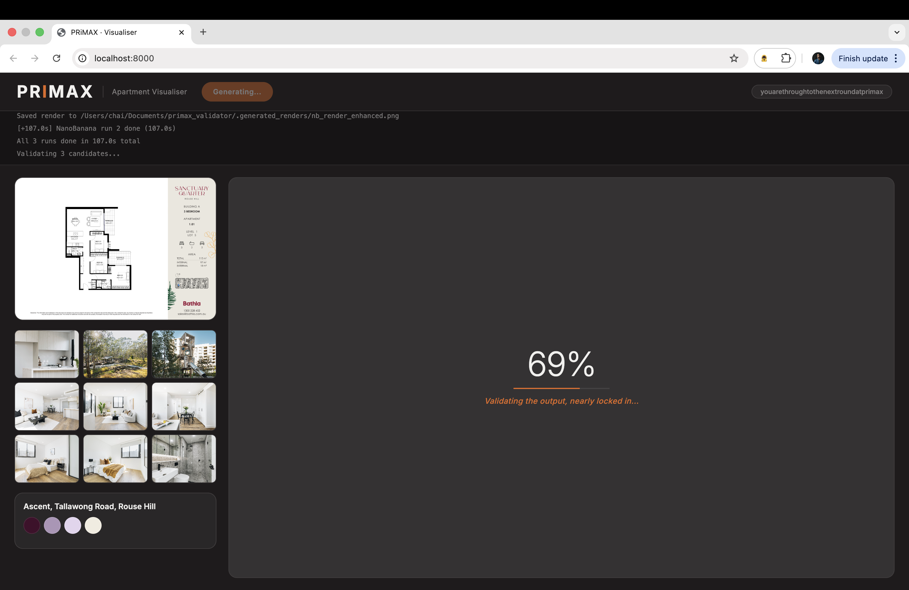
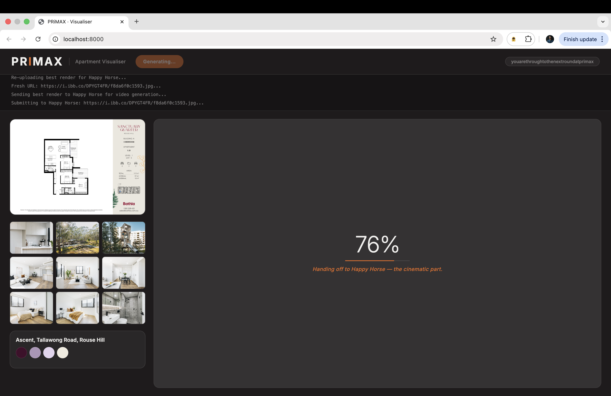
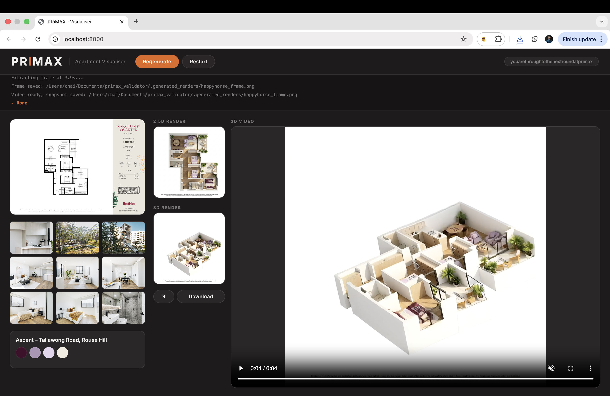

# PRiMAX · Apartment Visualiser

Turn a 2D floor plan into a furnished 2.5D render and cinematic 3D video — automatically.

Upload a zip with your floor plan PDF, reference renders, and brand guide. The pipeline reads the documents, runs parallel AI renders, validates them, and produces a flythrough video — all without touching a 3D modelling tool.

---

## Demo

### 1. Welcome screen


### 2. Upload your project zip — workspace loads instantly


### 3. Hit Generate — specs extracted in parallel


### 4. Three NanoBanana renders fire simultaneously


### 5. Claude Vision validates and picks the best render


### 6. Best render handed off to Happy Horse for video generation


### 7. Result — 2.5D render + 3D isometric video


---

## How it works

```
ZIP upload
    │
    ├── geometry_agent   — Claude reads 2D floor plan PDF → room dimensions & layout
    ├── spec_agent       — Claude reads reference renders → finishes & materials
    └── brand_agent      — Claude reads brand guide PDF → colours, fonts, mood
            │
            ▼
    3× NanoBanana (parallel)
        Image-to-image renders of the floor plan with applied finishes
            │
            ▼
    validator_agent
        Claude Vision scores each render → picks the best
            │
            ▼
    Happy Horse (fal.ai)
        Best render → cinematic isometric flythrough video
```

---

## Stack

| Layer | Technology |
|---|---|
| Backend | FastAPI + Python |
| AI orchestration | Anthropic Claude (claude-sonnet) |
| 2.5D rendering | NanoBanana generate-2 API |
| Video generation | Happy Horse via fal.ai |
| Image hosting | imgbb |
| Frontend | Vanilla JS + CSS |
| Deployment | Render.com |

---

## Setup

### Requirements

- Python 3.11+
- ffmpeg installed (`brew install ffmpeg`)

### Install

```bash
git clone https://github.com/ChaiAbs/primax-validator.git
cd primax-validator
python -m venv venv
source venv/bin/activate
pip install -r requirements.txt
```

### Environment variables

Create a `.env` file:

```
ANTHROPIC_API_KEY=...
NANOBANANA_API_KEY=...
FAL_KEY=...
IMGBB_API_KEY=...
```

### Run

```bash
uvicorn main:app --host 0.0.0.0 --port 8000 --reload
```

Open [http://localhost:8000](http://localhost:8000).

---

## Input zip format

```
project.zip
├── 2D Plan.pdf          # Floor plan (required)
├── Renders/             # Reference interior renders (jpg/jpeg)
│   ├── render_01.jpg
│   └── ...
└── Brand Guide.pdf      # Brand identity document (required)
```

---

## Output

- **2.5D render** — furnished top-down floor plan with brand finishes applied
- **3D video** — cinematic isometric flythrough (720p, ~4 seconds)
- **Snapshot frame** — PNG extracted from video, downloadable in bulk
