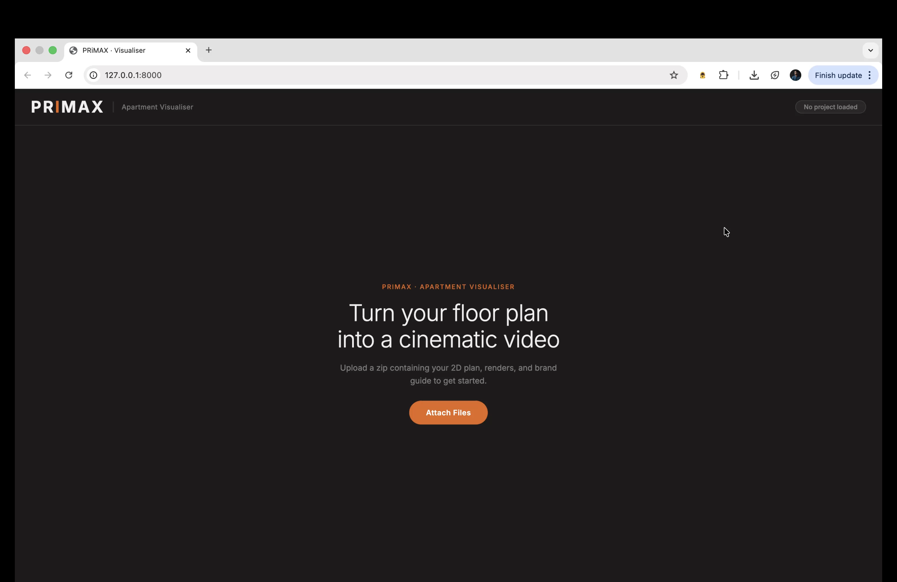
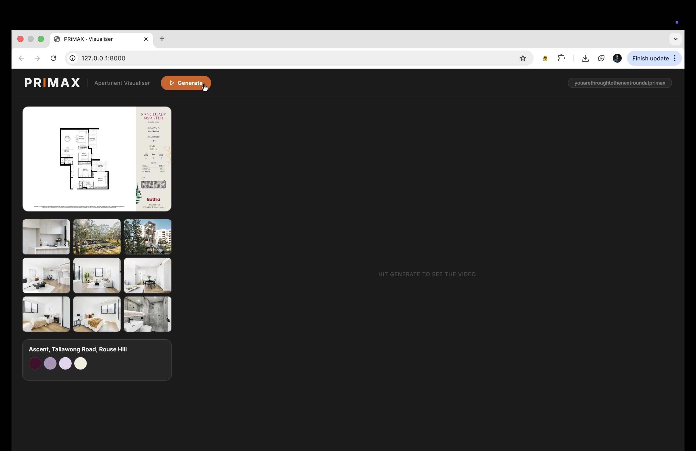
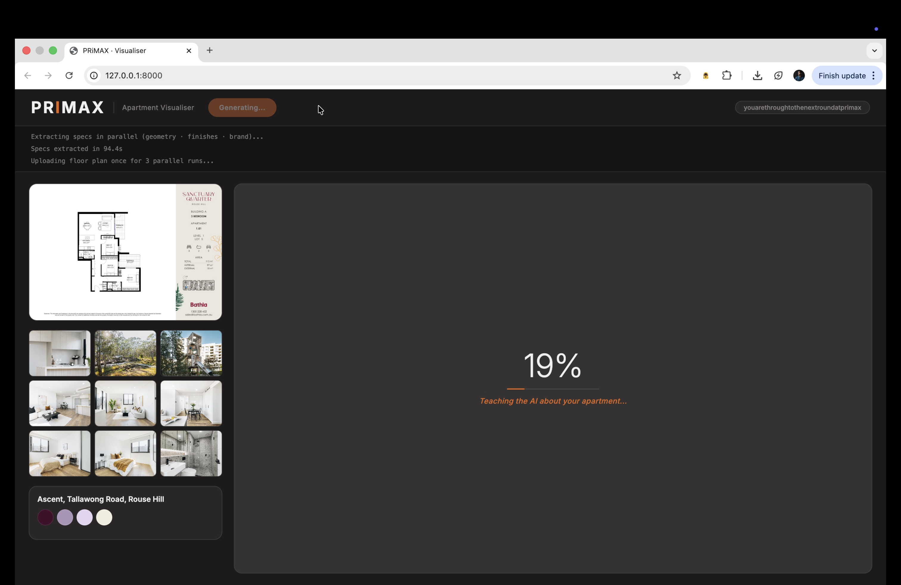

# PRiMAX · Apartment Visualiser

Turn a 2D apartment floor plan into a furnished 2.5D render and cinematic 3D video — automatically, using AI.

Upload a zip file containing your floor plan PDF, reference renders, and brand guide. PRiMAX extracts the geometry, finishes, and brand identity from your documents, runs parallel AI renders, validates the best result, and produces a short orbit video — all from a single button press.

---

## How It Works

The pipeline runs in two user-controlled stages.

**Stage 1 — Generate**
Extracts specs from your documents and produces a furnished 2.5D floor plan render using NanoBanana (image-to-image AI). Three renders are produced in parallel and scored by Claude Vision; the best one is selected automatically.

**Stage 2 — Continue**
Takes the best 2.5D render and sends it to Happy Horse (image-to-video AI) to produce a short cinematic orbit video with a 3D snapshot frame extracted at a set timestamp.

You review the 2.5D render before committing to the video stage. If the render isn't right, hit **Regenerate** to re-run Stage 1 from scratch. When you're happy, hit **Continue**.

---

## Screenshots

### 1. Welcome Screen



The landing page. Click **Attach Files** to upload a `.zip` containing your project assets. No configuration needed — everything is extracted automatically from the documents inside.

**What to include in the zip:**
- A PDF with `2d`, `floor`, or `plan` in the filename — the 2D floor plan (used for geometry and room extraction)
- Any other PDF — treated as the brand guide (colours, mood, typography)
- `.jpg` / `.jpeg` files — reference renders (interior photography, lifestyle shots)

---

### 2. Project Loaded



After upload, the workspace loads with:
- **Floor plan** (top left) — the 2D plan rendered from the PDF
- **Reference renders** (grid) — interior photos from the zip, used to guide finishes and material selection
- **Brand card** (bottom left) — project name and brand colours extracted automatically from the brand PDF
- **Generate button** — ready to start the pipeline

The project name is shown in the top-right tag, derived from the zip filename.

---

### 3. Stage 1 — Spec Extraction



Hitting **Generate** kicks off Stage 1. The pipeline extracts three structured specs from your documents in parallel:

- **Geometry spec** — room names, dimensions, and counts read from the floor plan PDF
- **Finishes spec** — flooring, wall colours, and material choices inferred from the reference renders
- **Brand spec** — primary colours, mood, and lighting style extracted from the brand PDF (cached after the first run — deterministic, so no need to re-extract)

Progress is shown as a live percentage with a contextual quip. The log strip at the top scrolls with real-time pipeline output.

---

### 4. Stage 1 — Parallel NanoBanana Renders + Validation


Once specs are extracted, the floor plan is uploaded once and submitted to NanoBanana three times simultaneously. Each run produces a furnished 2.5D top-down render applying the extracted geometry, finishes, and brand palette.

All three renders complete, then Claude Vision scores each one against the original floor plan for:
- **Structural accuracy** — correct room count, labels, dimensions, and layout fidelity
- **Hallucinations** — phantom rooms, wrong annotations, or invented spaces

The highest-scoring render is selected automatically as the best candidate. Progress reaches ~50% at the end of this stage.

---

### 5. 2.5D Render Ready — Review Before Continuing


When Stage 1 completes, the best 2.5D render fills the main tile at full size. The strip on the left shows a **50%** badge — the pipeline is halfway through.

Two actions are available:

- **Regenerate** — discard the current render and re-run Stage 1 from scratch (new spec extraction + 3 new NanoBanana runs + re-validation). Brand spec is reused from cache.
- **Continue** — accept the render and proceed to Stage 2 (Happy Horse video generation)

This is the review checkpoint. You stay here as long as needed before committing to the video.

---

### 6. Stage 2 — Happy Horse Video Generation


Clicking **Continue** starts Stage 2. The 2.5D render moves into the left strip as a thumbnail and the main tile shows live progress picking up from 50%.

The best render is re-uploaded and submitted to Happy Horse with the prompt:

> *"Zoom out and tilt camera to a 45-degree isometric angle, walls rising into view, revealing the apartment in three dimensions."*

Progress crawls from 50% → 100% with milestones at submission (~58%), video download (~75%), and frame extraction (~90%).

---

### 7. Final Result — Video + 3D Snapshot + Download


When the pipeline completes:

- **Main tile** — the cinematic MP4 plays on loop
- **2.5D Render strip** — the NanoBanana render thumbnail; click to expand into the main tile
- **3D Render strip** — a PNG snapshot extracted from the video at 3.9 seconds; click to expand
- **3D Snapshot button** — capture the current video frame as a still at any moment during playback
- **Download** — set a count and download 1 or more copies of the snapshot as PNG (or a zip for multiples)

Three header buttons are available at this stage:
- **Regenerate** — re-run Stage 1 (fresh renders, brand spec stays cached)
- **Regenerate Video** — re-run Stage 2 only, keeping the existing 2.5D render
- **Restart** — reload the page and start a new project

---

## Tech Stack

| Component | Technology |
|---|---|
| Backend | FastAPI (Python) |
| Spec extraction | Claude claude-sonnet-4-6 (Anthropic) via document vision |
| 2.5D rendering | NanoBanana (image-to-image) via imgbb hosting |
| Render validation | Claude Vision — structural + hallucination scoring |
| Video generation | Happy Horse (`alibaba/happy-horse/image-to-video`) via fal.ai |
| Frame extraction | ffmpeg |
| Frontend | Vanilla JS + SSE (Server-Sent Events) for real-time progress |

---

## Setup

```bash
# Clone and install
git clone <repo>
cd primax_validator
python -m venv venv && source venv/bin/activate
pip install -r requirements.txt

# Configure environment variables
cp .env.example .env
# Fill in: ANTHROPIC_API_KEY, FAL_KEY, IMGBB_API_KEY

# Run
uvicorn main:app --host 0.0.0.0 --port 8000
```

Open `http://localhost:8000` in your browser.

---

## Input Zip Format

```
project.zip
├── floor_plan_2d.pdf       # 2D plan (filename must contain "2d", "floor", or "plan")
├── brand_guide.pdf         # Brand / style guide (any other PDF)
├── render_01.jpg           # Reference interior renders
├── render_02.jpg
└── ...
```

Renders can also be nested inside a `renders.zip` within the outer zip.

---

## Project Structure

```
primax_validator/
├── main.py                  # FastAPI app — upload, SSE stream, download endpoints
├── pipeline.py              # Stage orchestration: run_nb_stage(), run_hh_stage()
├── config.py                # Paths (DATA_DIR, CACHE_DIR, RENDERS_OUTPUT_DIR)
├── agents/
│   ├── geometry_agent.py    # Extracts room layout from floor plan PDF
│   ├── spec_agent.py        # Extracts finishes from reference renders
│   ├── brand_agent.py       # Extracts brand identity from brand PDF (cached)
│   ├── refine_agent.py      # NanoBanana render runner — parallel x3, retry on failure
│   ├── validator_agent.py   # Claude Vision scoring of render candidates
│   └── happyhorse_agent.py  # Happy Horse video generation + ffmpeg frame extraction
└── static/
    ├── index.html
    ├── app.js
    └── style.css
```
